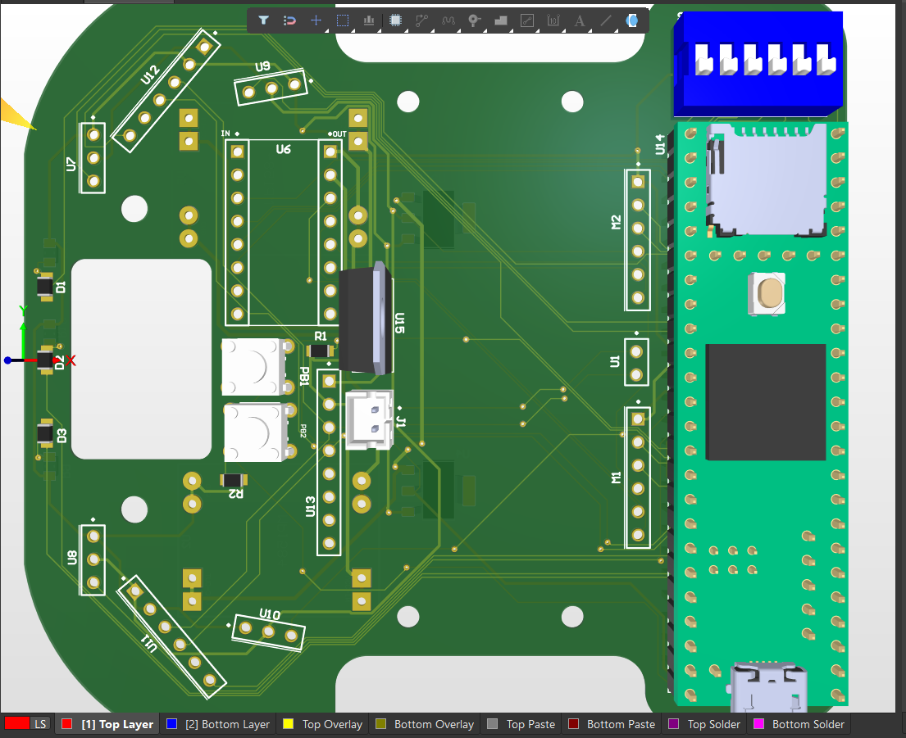
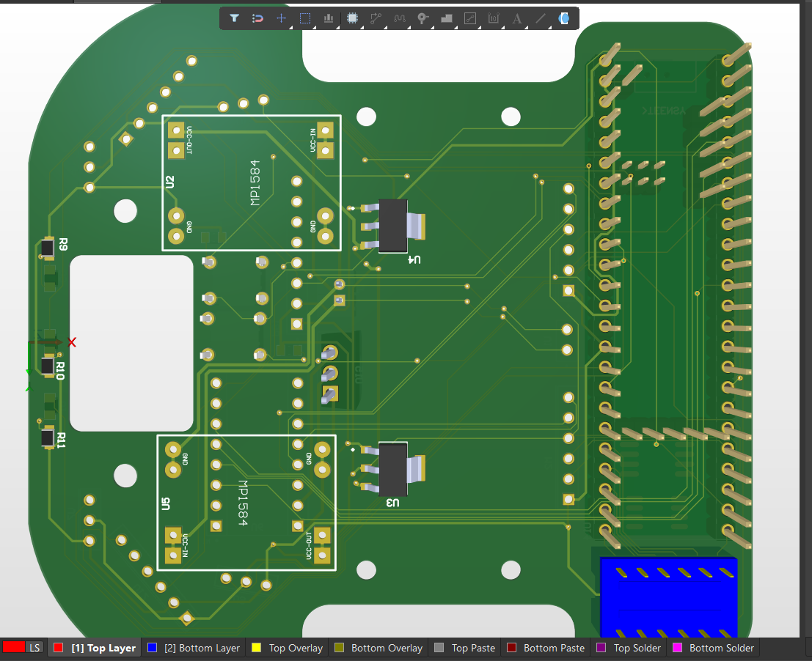
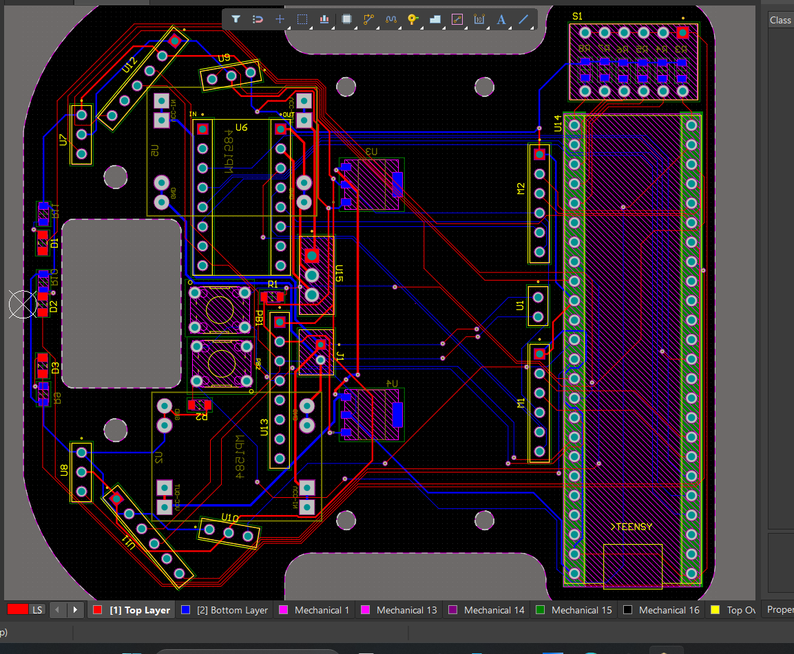

# 🐭 Pumchi Musikaya V2.0

<p align="center">
  
</p>

<h3 align="center">
Second Generation Autonomous Micromouse Robot
</h3>

<p align="center">
A high-speed autonomous maze-solving robot featuring a fully custom-designed PCB, 
embedded motion control, sensor fusion, and intelligent navigation algorithms.
</p>

<p align="center">


</p>


# 📖 Overview

**Pumchi Musikaya V2.0** is the second version of our autonomous Micromouse robot developed for maze-solving competitions.

The main objective of this version was to improve the reliability, compactness, and performance of the robot by designing a **custom integrated PCB** that combines the major electronic components into a single optimized platform.

Unlike the previous version, this robot integrates the microcontroller interface, motor control circuitry, sensor connections, power management, and communication interfaces into a custom PCB designed using **Altium Designer**.

The robot is capable of:

- Autonomous maze exploration
- Wall detection using Time-of-Flight sensors
- Orientation estimation using IMU feedback
- Precise motion control using encoder feedback
- Shortest-path calculation
- High-speed maze traversal


---

# ✨ Key Features

- ⚡ Teensy 4.1 high-performance microcontroller
- 🔌 Fully custom-designed PCB
- 🛞 High-speed N20 metal gear motors (1000 RPM)
- 🎯 Pololu motor drivers for efficient motor control
- 📏 VL53L0X Time-of-Flight distance sensors
- 🧭 MPU6050 IMU for orientation estimation
- 🔄 Closed-loop motor control
- 🗺 Flood Fill maze-solving algorithm
- 🚀 Optimized high-speed navigation


---

# 🛠 Hardware Specifications

| Component | Description |
|-----------|-------------|
| Microcontroller | Teensy 4.1 |
| Processor | ARM Cortex-M7 @ 600 MHz |
| Motors | N20 Metal Gear Motors (1000 RPM) |
| Motor Driver | Pololu Motor Driver |
| Distance Sensors | VL53L0X Time-of-Flight Sensors |
| IMU | MPU6050 |
| Drive System | Differential Drive |
| PCB Design Tool | Altium Designer |
| Chassis Design | DXF CAD Drawing |
| Battery | Li-Po Battery |


---

# 🔥 Custom PCB Design

A major improvement in Pumchi Musikaya V2.0 is the integration of all electronic subsystems into a custom-designed PCB.

The PCB contains:

- Teensy 4.1 controller interface
- Motor driver connections
- Motor power distribution
- VL53L0X sensor interfaces
- MPU6050 IMU interface
- Encoder connections
- Battery input
- Voltage regulation circuitry
- Debug/programming headers


## PCB 3D Views


### Top View

<p align="center">

</p>


### Bottom View

<p align="center">

</p>


### Manufactured PCB

<p align="center">

</p>


---

# 📐 PCB Design Files

The complete PCB design was developed using **Altium Designer**.

Available files:

```
PCB
│
├── PCB1.PcbDoc        # PCB Layout
├── Sheet1.SchDoc      # Circuit Schematic
├── Sheet1.pdf         # Schematic Documentation
├── 3D_view_top.png    # PCB 3D Top View
├── 3D_view_bottom.png # PCB 3D Bottom View
└── pcb.png            # PCB Image
```

---

# ⚙️ Mechanical Design

The robot chassis was designed specifically for:

- Compact PCB integration
- Stable differential drive motion
- Optimized sensor placement
- Low center of gravity
- High-speed operation


Chassis drawing:

```
PCB
│
└── chassy_V5.DXF
```


---

# 🤖 System Architecture


```
                 +----------------+
                 |  Teensy 4.1    |
                 +--------+-------+
                          |
        ---------------------------------
        |               |               |
     MPU6050        VL53L0X        Encoders
        |               |               |
        ---------------------------------
                          |
                  Sensor Processing
                          |
                          |
                  Maze Navigation
                          |
                  Flood Fill Algorithm
                          |
                  Motion Controller
                          |
                          |
                Pololu Motor Driver
                          |
                          |
                 N20 Gear Motors
```


---

# 🧠 Software Architecture


```
Sensor Acquisition
        |
        |
Sensor Filtering
        |
        |
Wall Detection
        |
        |
Maze Mapping
        |
        |
Flood Fill Algorithm
        |
        |
Path Planning
        |
        |
PID Motion Control
        |
        |
Motor Control
```


---

# 🗺 Maze Solving Algorithm

The robot follows the standard Micromouse solving pipeline:

### 1. Exploration Phase

- Move through unknown maze
- Detect walls using VL53L0X sensors
- Store maze information


### 2. Mapping Phase

- Generate internal maze representation
- Update wall information dynamically


### 3. Path Planning

- Apply Flood Fill algorithm
- Calculate shortest path


### 4. Speed Run

- Execute optimized path
- Maintain accurate heading and velocity control


---

# 🎯 Motion Control

Precise movement is achieved using:

- Motor feedback
- IMU orientation correction
- PID-based velocity control
- Sensor-based wall alignment


Control objectives:

✅ Straight-line movement  
✅ Accurate 90° turns  
✅ Stable wall following  
✅ Repeatable navigation  


---

# 📂 Repository Structure


```
Pumchi_Musikaya_V2.0
│
├── Firmware
│   └── Embedded control code
│
├── PCB
│   ├── PCB1.PcbDoc
│   ├── Sheet1.SchDoc
│   ├── Sheet1.pdf
│   ├── 3D_view_top.png
│   ├── 3D_view_bottom.png
│   ├── pcb.png
│   └── chassy_V5.DXF
│
├── CAD
│
├── Images
│
└── README.md
```


---

# 📸 Gallery


## PCB Design

<p align="center">


</p>


## Robot Assembly

(Add robot images here)

---

# 🚀 Future Improvements

- Advanced sensor fusion algorithms
- Higher speed optimization
- Improved trajectory planning
- Lightweight PCB redesign
- Machine learning based navigation


---

# 👥 Team

## Team ThunderBots

Department of Electronic and Telecommunication Engineering  
University of Moratuwa


---

# 📜 License

This project is developed for educational and research purposes.
